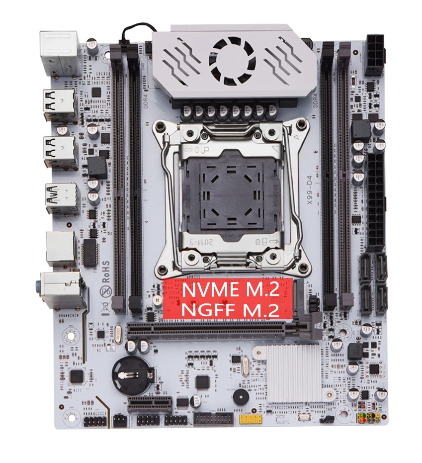

# Qiyida X99 D4 (C612) - BIOS Update
<p align="center">
  
</p>
Este repositorio contiene una versión actualizada y segura del firmware para la placa base china **Qiyida X99 D4 (Chipset C612 / X99)(10 PINS TPM VERSION)**. 

El objetivo de este proyecto es proveer una base de firmware 100% estable, utilizando los módulos originales de fábrica pero inyectando los últimos parches de seguridad de Intel (microcodigos).

## ⚠️ Advertencia
Flasear una BIOS siempre conlleva riesgos. **No uses AFUDOS/AFUWIN**. Se recomienda encarecidamente flashear usando Intel FPT (Flash Programming Tool) y tener a mano un programador CH341A como método de recuperación en caso de fallo. Úsalo bajo tu propio riesgo.

---

## 🛠️ Mejoras y Cambios Implementados

### 1. Actualización de Microcódigos Intel (2024)
Se han reemplazado los microcódigos obsoletos de fábrica (2015-2019) por las versiones más recientes disponibles de Intel. Esto no solo mejora la seguridad, sino que soluciona pantallazos azules, congelamientos en estados de reposo (C-States) y fallos en virtualización.

| Procesador | CPUID | Microcódigo Original | Nuevo Microcódigo | Fecha del Parche |
| :--- | :---: | :---: | :---: | :---: |
| **Haswell-E/EP (Xeon v3)** | `306F2` | Rev `3D` (2018) | **Rev `49`** | Agosto 2021 |
| **Broadwell-E/EP (Xeon v4)** | `406F1` | Rev `38` (2019) | **Rev `41`** | Febrero 2024 |

**Vulnerabilidades mitigadas con esta actualización:**
- MDS (Microarchitectural Data Sampling) / ZombieLoad
- CrossTalk / SRBDS
- MMIO Stale Data
- **Downfall (GDS) y RFDS** (Crítico para instrucciones AVX2/AVX-512 en plataformas X99).

### 2. Herramientas Utilizadas
Para garantizar que la estructura de la BIOS y los checksums (FIT - Firmware Interface Table) permanezcan intactos y funcionales, las modificaciones se hicieron mediante las herramientas oficiales de fabricantes:
- **MMTool Aptio 5.0.2.0024** (Para inyección segura de microcódigos y recálculo de la tabla FIT).
- **MCExtractor v1.104.0** (Para la verificación criptográfica y hexadecimal de los microcódigos instalados).
- **UEFITool 0.28.0** (Para extracción y análisis estructural de los volúmenes DXE).

---

## 🚀 Instrucciones de Flasheo (Vía Windows/DOS)

Se recomienda encarecidamente utilizar Intel FPT (v9 o v10, dependiendo de la versión de Intel ME de tu placa).

1. Abre una consola de comandos como Administrador (CMD o PowerShell).
2. Realiza un backup de tu BIOS actual:
   ```cmd
   fptw64.exe -d backup_original.rom
   ```
3. Flashea la nueva BIOS:
   ```cmd
   fptw64.exe -bios -f qiyida_FINAL.rom
   ```
4. **Paso Crítico:** Tras el flasheo exitoso, apaga el ordenador, desconéctalo de la corriente y retira la pila CR2032 de la placa base durante 5 minutos para hacer un **Clear CMOS**.
5. Enciende el PC, entra a la BIOS y carga los valores óptimos (Restore Defaults).

---

## 📝 Créditos y Notas
- Microcódigos proporcionados por el repositorio oficial de [platomav/CPUMicrocodes](https://github.com/platomav/CPUMicrocodes).
- Análisis estructural de BIOS realizado para asegurar la máxima estabilidad sin corromper los padding files de la arquitectura Aptio V.
