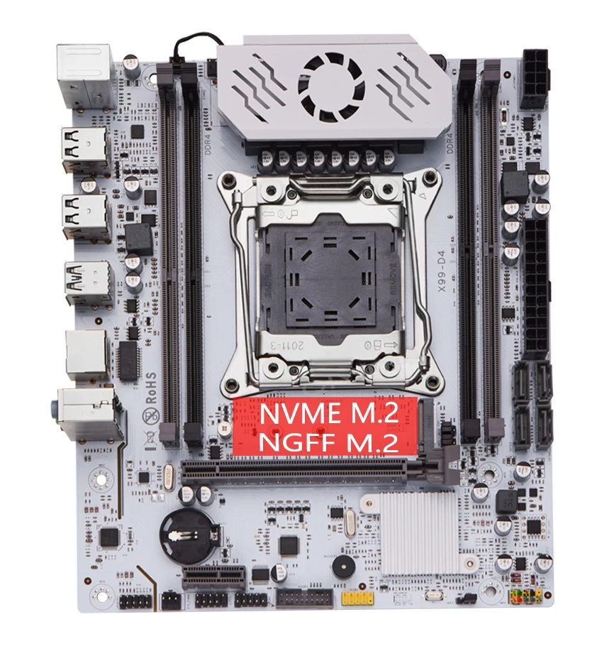

# Qiyida X99-D4 (Chipset Intel C612 / Socket LGA2011-3) - Firmware Repository

[English documentation / Documentacion en Ingles](README_EN.md)

<p align="center">
  
</p>

Repositorio de firmware oficial y modificado para la placa base Qiyida X99-D4 (Revision 2.0 con conector TPM 2.0 de 10 pines).

---

## 1. Especificaciones de Hardware de la Plataforma

| Componente | Especificacion de Hardware |
| :--- | :--- |
| Placa base | Qiyida X99-D4 v2.0 (OEM Jginyue / Machinist) |
| Socket | LGA2011-3 (Intel Socket R3) |
| Chipset (PCH) | Intel C612 Wellsburg-G Server (Device ID `0x8D4A`) |
| Procesadores compatibles | Intel Xeon E5-1600/2600 v3 (Haswell-EP), Xeon E5-1600/2600 v4 (Broadwell-EP), Core i7 5800/5900/6800/6900 |
| Memoria RAM | DDR4 4 canales: soporte simultaneo para UDIMM (Non-ECC) y RDIMM (ECC Registrada de servidor) |
| Super I/O | Nuvoton NCT5532D (LQFP-64, Chip ID `0xC560`, detectado en CPU-Z como `Nuvoton NCT6779`) |
| Interfaz de Red (LAN) | Realtek RTL8111H Gigabit Ethernet PCIe |
| Chip SPI Flash | 16 MB / 128 Mb (Winbond W25Q128 / Macronix MX25L128 / GigaDevice GD25Q128) |

---

## 2. Inventario de Archivos de Firmware

| Archivo | Tamano | SHA-256 | Descripcion |
| :--- | :--- | :--- | :--- |
| `qiyidax99d4interfazgraficamodbeta.rom` | 16,777,216 bytes | `f208445b5cfd55b8d171e288f237baae45fc2286d5844f386bbf5c46205a16d3` | Firmware completo de 16 MB con interfaz grafica UEFI de Gigabyte reparada, mitigacion AltMeDisable, microcodigos 2024, Super I/O Nuvoton y LAN Realtek. |
| `qiyidax99d4BiosUpdate.rom` | 16,777,216 bytes | `0bca95f4869ecdbbeac3d4d528b34063697dea17473a2a0adf2162ed77284b45` | Firmware de produccion basado en la BIOS original con microcodigos 2024 (Haswell rev 49, Broadwell rev 41). Flasheable por software con `fptw64 -bios`. |
| `qiyidax99d4ORIGINAL.rom` | 16,777,216 bytes | `0220fc2e42061ebde1634f231a52951631fc64e015770ba5fdd140e00b5e32d1` | Volcado de fabrica integro (Intel SPS 3.1.3.72, BIOS 8 MB). |

---

## 3. Ingenieria Inversa y Reparaciones Estructurales Realizadas

En `qiyidax99d4interfazgraficamodbeta.rom` se corrigieron integralmente los defectos de bajo nivel que existian en versiones experimentales previas:

### 3.1 Reparacion del Vector de Arranque Multiprocesador (Offset `0x00FFD000`)
En compilaciones previas no funcionales, la herramienta de reconstruccion relleno con bytes planos `0xFF` el area de padding en `0x00FFD000`, borrando el anclaje de reset de los nucleos secundarios.
- **Mecanica del fallo:** Cuando el procesador principal (BSP) envia la interrupcion de inicio SIPI (vector `0xFD`), los nucleos auxiliares (APs) inician ejecucion en la direccion fisica `0xFD000` (mapeada en `0x00FFD000`). Al encontrar `0xFF 0xFF`, la CPU genera una excepcion `#UD` (Invalid Opcode) sin tabla IDT cargada, culminando en un Triple Fault instantaneo antes de completar la fase PEI.
- **Correccion aplicada:** Se restauro la instruccion x86 en modo real de 16 bits:
  ```assembly
  EA D0 FF 00 F0 00 00 00 00 00 00 00 00 00 27 2D  ; jmp far F000:FFD0
  ```
  Esto enlaza el salto con el vector en `0x00FFFFD0` dentro del SEC Core, permitiendo la inicializacion en modo protegido de todos los nucleos del Xeon.

### 3.2 Trasplante y Adaptacion del Super I/O (Nuvoton NCT5532D / NCT6779)
- **Identificacion del silicio:** El chip fisico soldado en el PCB es un Nuvoton en encapsulado compacto LQFP-64 (7 mm x 7 mm, 16 pines por lado). Al consultar los registros `0x20` (Chip ID High = `0xC5`) y `0x21` (Chip ID Low/Rev = `0x62` o `0x63`) con la mascara de familia `0xFFF8`, devuelve el codigo `0xC560`. En las bases de datos de hardware (CPUID, CPU-Z, HWMonitor, driver Linux `nct6775`), el codigo `0xC560` esta catalogado bajo el nombre de la familia: `Nuvoton NCT6779`. El silicio logico interno es identico.
- **Correccion en fase PEI:** La base de Gigabyte incluia el driver `IT8728FPeiInit` que enviaba secuencias de desbloqueo ITE (`87 01 55 55`), bloqueando el bus LPC. Se extirpo dicho modulo y se inyecto en `0x00C0D8D0` el driver oficial de Qiyida `NCT5532DPeiInit` (`9029F23E-E1EE-40D1-9382-36DD61A63EAA`).
- **Decodificacion LPC en el Chipset C612:** El driver programa los rangos del puente LPC en el PCH:
  - Rango 1: Base `0x002E` (Index/Data Super I/O).
  - Rango 2: Base `0x0060` (Teclado y raton PS/2 en `0x60/0x64`).
  - Rango 3: Base `0x0A00` de 64 bytes (`0x0A00..0x0A3F` para Hardware Monitor y lectura termica).
  - Envia la clave Nuvoton `0x87, 0x87` y configura el controlador de teclado KBC (LDN 05).
- **Fase DXE:** Se integro `SioDxeInit` (`4E82091E-32A1-4689-8A00-CDE41ED63CDD`) en `0x0031B220`, garantizando el protocolo `EFI_SIO_PROTOCOL` para el puerto serie COM1 (`0x3F8`, IRQ 4) y la lectura de sensores.

### 3.3 Mitigacion del Apagado a los 30 Minutos (Intel ME / SPS en Chipset C612)
- **Causa raiz:** La placa Qiyida monta un chipset de servidor Intel C612 (Wellsburg-G), disenado para ejecutar firmware Intel Server Platform Services (SPS 3.1). Al cargar el firmware UEFI de Gigabyte (disenado para Intel ME 9.1/10.0 de consumo), la comunicacion HECI no sincroniza con los fusibles de servidor del PCH, provocando que el Intel ME Watchdog Timer fuerce el apagado total del equipo a los 30 minutos de funcionamiento.
- **Correccion aplicada:** En el Intel Flash Descriptor, se modifico el registro de soft straps `PCHSTRP10` (offset `0x0128`) activando el bit 7 (`AltMeDisable = 1`):
  ```text
  Offset 0x0128: 00 00 80 00 -> 80 00 80 00
  ```
  Este parametro ordena al motor Intel ME detenerse de forma limpia una vez finalizada la generacion inicial de frecuencias del PCH, impidiendo el disparo del temporizador de apagado por watchdog.

### 3.4 Extirpacion de 24 Modulos Parasitos de Gigabyte
Para evitar bloqueos y demoras en el POST por consulta a hardware no presente en la placa Qiyida, se eliminaron y reemplazaron por bloques de relleno UEFI PAD limpios los siguientes 24 modulos:
1. **Gigabyte DualBIOS (6 modulos):** `DualBiosCSPPei`, `DualBiosPlusPei`, `DualBiosDxe`, `DualBiosPlusDxe`, `DualBiosSmm`, `DualBiosPlusSmm`. Elimina bucles de reinicio causados por la busqueda del segundo chip SPI fisico.
2. **Intel Thunderbolt Alpine Ridge (4 modulos):** `TbtPei`, `TbtXhciOnlyPei`, `TbtDxe`, `TbtSmm`.
3. **Controlador Secundario ITE EC 8790 (3 modulos):** `Ite8790ECPei`, `Ite8790ECDxe`, `Ite8790ECSmi`.
4. **Controladores de LED e Iluminacion ITE (4 modulos):** `ITEPowerLEDPei`, `ITEPowerLEDDxe`, `EcLedIndicatorPei`, `EcLedIndicatorSmm`.
5. **Gigabyte CellPhone OC (2 modulos):** `GBTCellPhoneOCDxe`, `GBTCellPhoneOCSmm`.
6. **Red Killer LAN (2 modulos):** `LxUndiBinE2400`, `LxUndiBinE2500`.
7. **SMM Features de ITE 8728 (3 modulos):** `IT8728FSmmFeaturesPei`, `IT8728FSmmFeaturesDxe`, `IT8728FSmmFeaturesSmm`.

### 3.5 Inyeccion ACPI DSDT y Driver LAN Realtek
- **DSDT:** Se inyecto la tabla ACPI oficial de Qiyida (`dsdt_qiyida.bin`, 210,878 bytes) en `0x006A4134`, declarando el mapeo real de puertos USB 2.0/3.0, pistas PCIe, Super I/O en `0x2E/0x2F` y 192 procesadores logicos.
- **LAN:** Se verifico la inclusion del driver Option ROM Realtek RTL8111H UEFI UNDI en `0x00817FF8`.

### 3.6 Microcodigos Oficiales Intel 2024 y Reconstruccion FIT
En el contenedor de microcodigos y en la tabla FIT (*Firmware Interface Table*, offset `0x00BF0000`), se actualizaron los parches de seguridad:

| CPUID | Stepping / Procesador | Revision | Fecha | Mitigaciones de Seguridad |
| :---: | :--- | :---: | :---: | :--- |
| `306F1` | Haswell-EP (Muestra de Ingenieria ES) | `80000013` | 2013-10-02 | Soporte de procesadores ES |
| `406F0` | Broadwell-EP (Muestra de Ingenieria ES) | `00000014` | 2015-07-02 | Soporte de procesadores ES |
| `306F2` | **Haswell-EP Comercial (Xeon E5 v3)** | **`49`** | 2021-08-11 | Downfall (GDS), CrossTalk / SRBDS, MDS, MMIO Stale Data |
| `406F1` | **Broadwell-EP Comercial (Xeon E5 v4)** | **`41`** | 2024-02-16 | Register File Data Sampling (RFDS 2024), Downfall (GDS), MDS |

---

## 4. Analisis de Protecciones de Flash y Desmitificacion del Pinmod (Clip de Audio)

En comunidades de modding existe la creencia de que se requiere puentear con un clip de papel los pines del chip de audio Realtek ALC durante 3 segundos para flashear placas base chinas con `fptw64.exe`. **Esto es innecesario en la placa Qiyida X99-D4**.

### 4.1 Evidencia en el Intel Flash Descriptor de Fabrica
En placas comerciales de fabricantes como ASUS o Gigabyte, el registro `FLMSTR1` del Flash Descriptor se bloquea de fabrica como `0x00020000`, denegando la escritura del host en el Descriptor y en el ME (`Error 26`).
En la BIOS de fabrica de la Qiyida X99-D4 ([qiyidax99d4ORIGINAL.rom](file:///c:/Users/Benja/Desktop/Qiyida-x99-D4-BIOS-UPDATE-TPM-10-PIN-VERSION--main/qiyidax99d4ORIGINAL.rom), offset `0x0060`), el registro viene configurado como:
```text
FLMSTR1 = 0xFFFF0000
Bits [23:16] Read Access  = 0xFF (Lectura total concedida en todas las regiones)
Bits [31:24] Write Access = 0xFF (Escritura total concedida en todas las regiones)
```
El hardware ya otorga permisos totales de lectura y escritura al procesador.

### 4.2 Estado de las Protecciones en NVRAM
- **`BIOS Lock`** (Registro PCH `BC` bits `BLE` / `SMM_BWP`): Configurado en **`Disabled (0)`** de fabrica. El driver SMM `PchBiosWriteProtect` no instala ningun manejador SMI de proteccion.
- **`Host Flash Lock-Down`** (`FLOCKDN`): Configurado en **`Disabled (0)`** de fabrica.
- **`Flash Protected Range Registers`** (`FPRR`): Inactivo.

---

## 5. Metodos de Flasheo e Instalacion

### Metodo 1: Flasheo por Software desde Windows con Intel FPT (Sin Hardware Externo)
Para flashear la imagen completa de 16 MB con la interfaz grafica (`qiyidax99d4interfazgraficamodbeta.rom`), se utiliza la opcion nativa de anulacion de proteccion de Intel ME incluida en la propia BIOS:

1. **Reiniciar y entrar a la BIOS:** Pulsar la tecla `Supr` o `Del` durante el encendido.
2. **Habilitar modo de sobrescritura de ME:**
   - Navegar a la pestana **`IntelRCSetup`**.
   - Entrar en **`Server ME Configuration`**.
   - Entrar en **`Manageability Application Configuration`**.
   - Cambiar la opcion **`Me FW Image Re-Flash`** de `Disabled` a **`Enabled`**.
   - Pulsar `F4` (Save & Exit).
3. **Reinicio automatico:** El equipo se reiniciara y durante el POST el driver `MeFwDowngrade` enviara el comando `HMRFPO_ENABLE`, forzando un reinicio en frio. El sistema arrancara con el motor Intel ME desprotegido.
4. **Flasheo en Windows:**
   - Iniciar sesion en Windows.
   - Abrir Símbolo del Sistema (`cmd.exe`) o PowerShell con **privilegios de Administrador** en la carpeta del repositorio.
   - Ejecutar la grabacion de la imagen de 16 MB:
     ```cmd
     fptw64.exe -f qiyidax99d4interfazgraficamodbeta.rom
     ```
   - FPT borrara, escribira y verificara todas las regiones flash (`FPT Operation Successful`).
5. **Clear CMOS Obligatorio:**
   - Apagar el equipo por completo y desconectar el cable de alimentacion de la fuente.
   - Retirar la pila de litio CR2032 de la placa durante 5 minutos para vaciar los registros de configuracion anteriores de la NVRAM.
   - Reinstalar la pila y encender: el equipo cargara nativamente en la interfaz grafica de Gigabyte.

---

### Metodo 2: Programador Fisico Externo SPI (CH341A)
Recomendado como metodo de maxima seguridad o para recuperacion en caso de fallos de corriente:
1. Conectar el programador USB CH341A con pinza de prueba SOIC-8 al chip SPI flash de la placa base (con la fuente de poder desconectada de la red electrica).
2. Abrir **NeoProgrammer** o **AsProgrammer**.
3. Detectar el chip flash SPI de 16 MB (Winbond W25Q128 o equivalente).
4. Realizar una lectura de respaldo previa (`Read IC`) y guardar el archivo (`backup_fabrica.bin`).
5. Abrir el archivo `qiyidax99d4interfazgraficamodbeta.rom`.
6. Ejecutar la secuencia: `Erase IC` -> `Write IC` -> `Verify IC`.
7. Retirar la pinza del chip, realizar un Clear CMOS de 5 minutos (retirando la pila CR2032) y encender el equipo.

---

### Metodo 3: Actualizacion Oficial de Microcodigos 2024 (`qiyidax99d4BiosUpdate.rom`)
Si unicamente se desea actualizar los microcodigos oficiales sobre la interfaz de texto de fabrica (sin modificar la GUI ni el layout de 8 MB de fabrica):
```cmd
fptw64.exe -bios -f qiyidax99d4BiosUpdate.rom
```
No requiere modificar ninguna opcion previa en la BIOS ni reprogramar la region ME.

---

## 6. Creditos y Referencias
- Microcodigos de procesadores Intel: repositorio oficial [platomav/CPUMicrocodes](https://github.com/platomav/CPUMicrocodes).
- Herramientas de analisis estructural de firmware: `UEFITool` y `UEFIExtract` por Nikolaj Schlej.
- Especificaciones de arquitectura de plataforma: *Intel C610 Series Chipset and Intel X99 Chipset Datasheet*, *Intel 64 and IA-32 Architectures Software Developer's Manual*.
